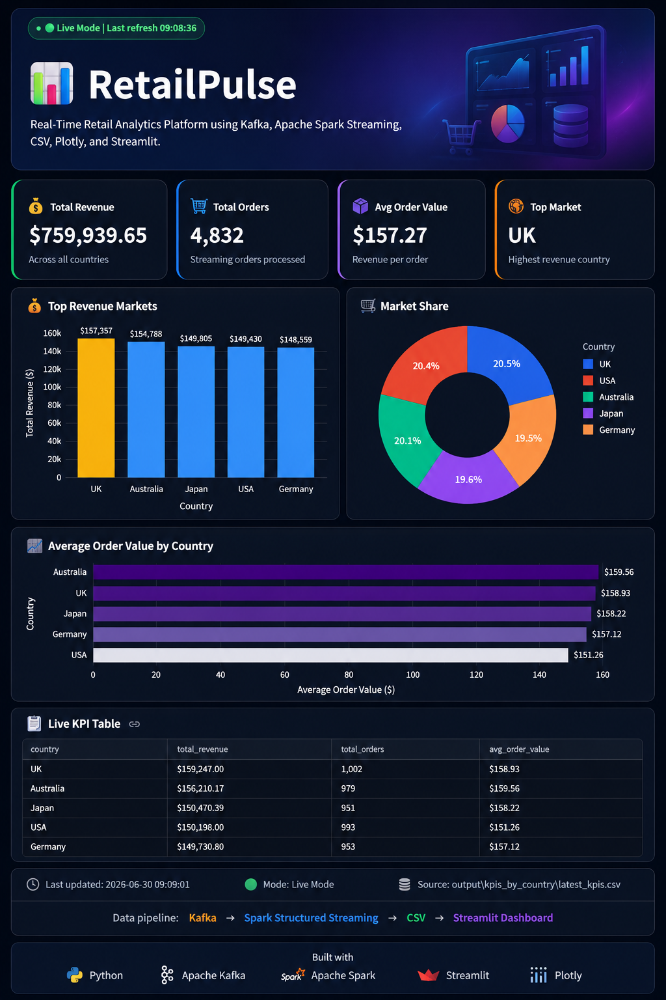

# 📊 RetailPulse

### Real-Time Retail Analytics Dashboard powered by Apache Kafka, Apache Spark Structured Streaming, Streamlit, and Plotly.

RetailPulse is a real-time retail analytics platform that simulates a modern streaming data pipeline. Sales events are continuously generated, streamed through Apache Kafka, processed using Apache Spark Structured Streaming, and visualized in an interactive Streamlit dashboard that updates automatically with business KPIs.

---

# 📸 Dashboard Preview



---

# ✨ Features

- ⚡ Real-time streaming analytics
- 📊 Interactive business dashboard
- 💰 Total Revenue monitoring
- 🛒 Live Total Orders tracking
- 📦 Average Order Value (AOV)
- 🌍 Top Revenue Market detection
- 📈 Revenue comparison across countries
- 🥧 Market share visualization
- 📉 Average Order Value comparison
- 📋 Live KPI Table
- 🔄 Auto-refresh dashboard
- 💾 Snapshot mode using CSV for demonstration

---

# 🏗 System Architecture

```
               +----------------+
               |   Producer.py  |
               +--------+-------+
                        |
                        ▼
              Apache Kafka Topic
                        |
                        ▼
      Apache Spark Structured Streaming
                        |
                        ▼
          KPI Aggregation & Processing
                        |
                        ▼
              latest_kpis.csv Snapshot
                        |
                        ▼
           Streamlit Interactive Dashboard
```

---

# 🛠 Tech Stack

| Category | Technology |
|----------|------------|
| Programming Language | Python |
| Streaming Platform | Apache Kafka |
| Stream Processing | Apache Spark Structured Streaming |
| Dashboard | Streamlit |
| Visualization | Plotly |
| Data Processing | Pandas |
| Data Storage | CSV Snapshot |

---

# 📁 Project Structure

```
RetailPulse/
│
├── dashboard.py
├── producer.py
├── spark_stream_kpis.py
├── requirements.txt
├── dashboard.png
├── README.md
│
└── sample_data/
      └── latest_kpis.csv
```

---

# 🚀 How It Works

1. **Producer.py** continuously generates retail sales events.
2. Events are streamed into **Apache Kafka**.
3. **Spark Structured Streaming** consumes the stream and calculates live KPIs.
4. KPIs are exported as a CSV snapshot.
5. **Streamlit** automatically reads the latest snapshot and refreshes the dashboard every few seconds.

---

# 📊 Business KPIs

The dashboard provides live insights including:

- Total Revenue
- Total Orders
- Average Order Value
- Top Revenue Market
- Revenue by Country
- Market Share
- Average Order Value by Country
- Live KPI Table

---

# 🎯 Demo Mode

To make this project easy to explore without installing Kafka or Spark, a sample KPI snapshot is included.

```
sample_data/latest_kpis.csv
```

When live streaming is unavailable, the dashboard automatically loads this snapshot so anyone can preview the complete dashboard.

---

# 🚀 Future Improvements

- Docker containerization
- Cloud deployment (AWS / Azure)
- Product-level analytics
- Time-series revenue trends
- Customer segmentation
- Interactive filters
- Database integration
- REST API support

---

# 💡 Key Highlights

- End-to-end real-time data pipeline.
- Streaming analytics using Apache Spark Structured Streaming.
- Interactive business intelligence dashboard.
- Clean and modern UI.
- Auto-refreshing KPIs.
- Suitable for Data Engineering and Data Analytics portfolios.

---

# ▶️ Run the Project

Install dependencies:

```bash
pip install -r requirements.txt
```

Start Kafka.

Run Spark Streaming:

```bash
python spark_stream_kpis.py
```

Run the Producer:

```bash
python producer.py
```

Launch the dashboard:

```bash
streamlit run dashboard.py
```

---

#  Author

**Norah Altimyat**

M.Sc. Data Science

Special interests:

- Data Science
- Machine Learning
- Data Engineering
- Big Data Analytics
- Real-Time Analytics
- Business Intelligence

